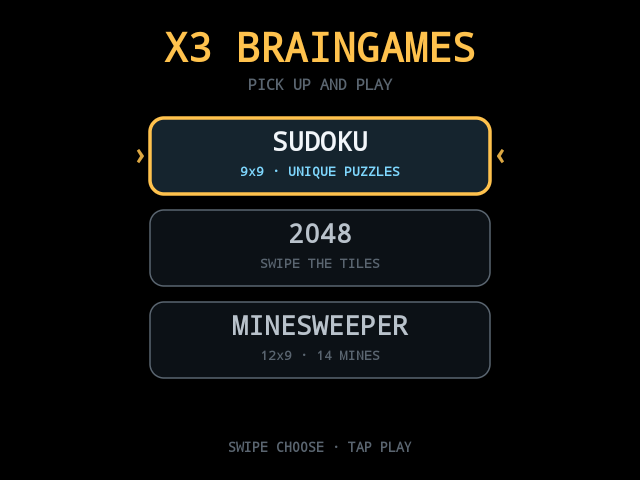
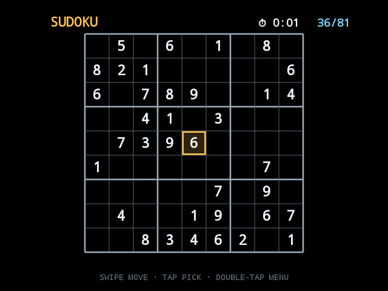

# X3BrainGames 🧠🥽

Three of the world's most-played pick-up-and-go brain games, rebuilt native
for the **RayNeo X3 Pro** smart glasses — chosen specifically for how well
they map to the glasses' temple-pad controls (one discrete step per swipe,
tap to act, no pointer chasing), all from one menu:

## Screenshots

<p>
  
  
</p>

- **SUDOKU** — 9×9, freshly generated every game with a uniqueness-checked
  digger (~36 givens). Swipe moves the cell cursor, tap opens a number
  picker, live conflict highlighting in red, solve timer with best time.
- **2048** — the swipe-native classic: four swipes are the whole game.
  Merge sounds climb in pitch with the tile value. Score + best.
- **MINESWEEPER** — 12×9, 14 mines, first-click always safe, flood reveal.
  Tap reveals, double-tap flags, classic colored counts, clear timer.

**Every move autosaves.** The complete board state is written after each
swipe, placement, reveal and flag — an accidental exit (temple bump,
launcher kill, dead battery) loses nothing. The menu shows a ▶ CONTINUE
badge wherever a game is waiting, and even the Sudoku clock picks up where
it stopped.

Controls everywhere: **swipe** step · **tap** act · **double-tap** the
game's secondary (flag / cancel picker) · **triple-tap** back to the menu.

## Real sounds

The ticks, placements, error buzz, mine boom, flag click and win chime are
real public-domain / CC recordings from Wikimedia Commons, trimmed and
repitched live — see `SOUND_CREDITS.md`.

## Build

Zero dependencies, Canvas 2D, side-by-side stereo autodetected on RayNeo.

```
./gradlew assembleDebug
```
